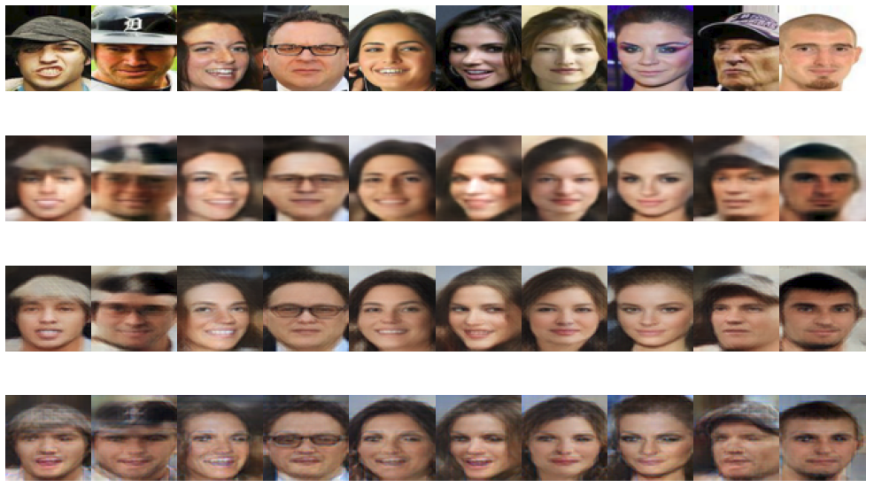

# Deep-Feature-Consistent-VAE
Pytorch Implementation of Hou, Shen, Sun, Qiu, "Deep Feature Consistent Variational Autoencoder", 2016

## Requirements
* Python 3.6.9
* numpy 1.19.0
* pillow 7.2.0
* pytorch 1.5.1
* tensorboard 2.2.2
* torchvision 0.6.1

## 1) Installing Dependencies
```
pip3 install -r requirements.txt
```

## 2) Train Vae
```
python3 train_vae.py --imgdir <path> --loss 0 -o pvae
python3 train_vae.py --imgdir <path> --loss 1 -o vae123
python3 train_vae.py --imgdir <path> --loss 2 -o vae345
```

## 3) Visualize Vae Reconstructions
Either execute the (modified) example script, i.e.
```
cd examples
bash visualize_vae.sh
```
or
```
python3 ../visualize_vae.py --vae pvae.pt vae123.pt vae345.pt --imgdir <path>
```
This should result in a plot similar to:

*From top to bottom: original image, pvae, vae123, vae345*

## 4) Visualize Linear Interpolation of Latent Space
Either execute the (modified) example script, i.e.
```
cd examples
bash visualize_latent_interpolation.sh
```
or
```
python3 ../visualize_latent_interpolation.py --vae vae123.pt --img_left <path1> --img_right <path2>
```
This should result in a plot similar to:

*α=0 ----------------------------------------------------------------------------------------------------------------------------------------------> α=1*